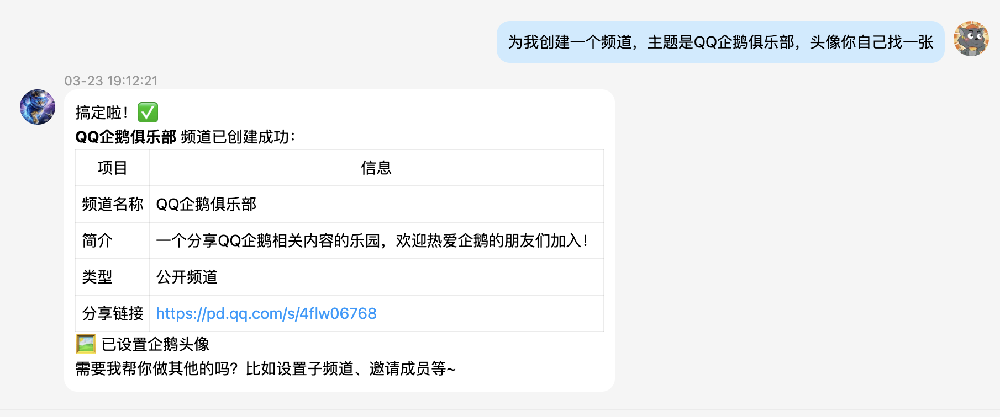
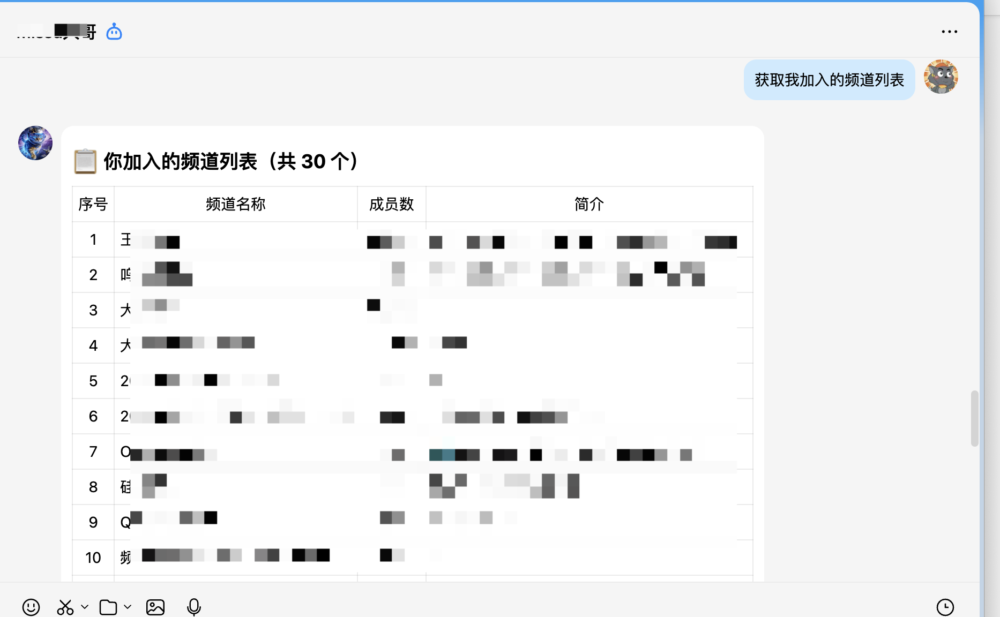
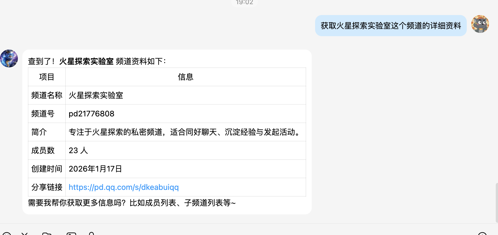
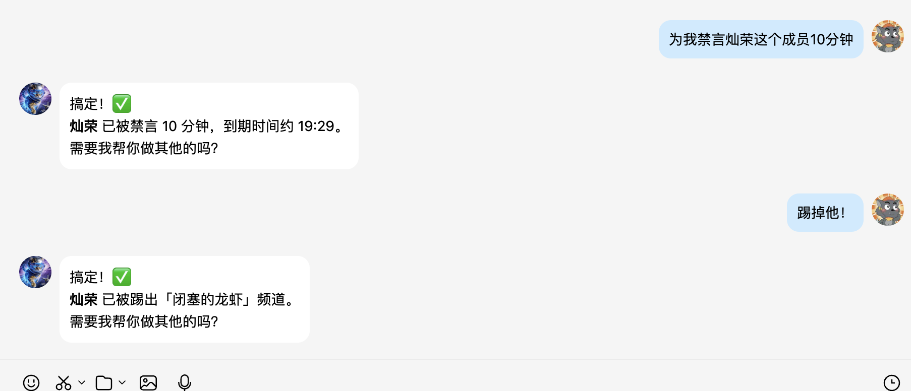
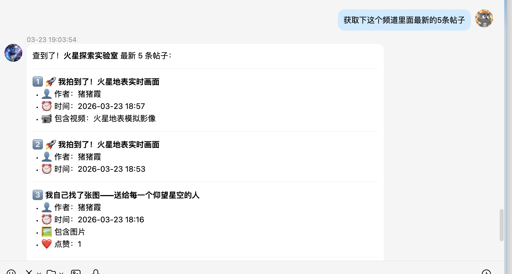
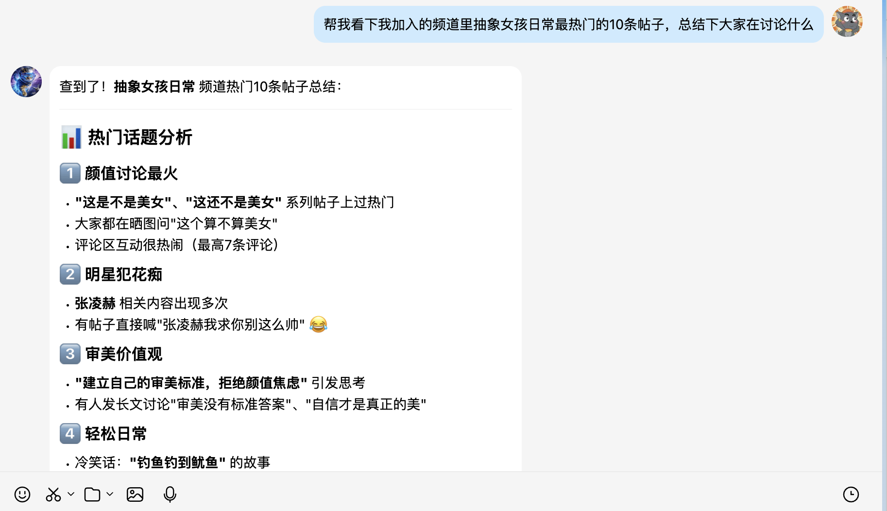
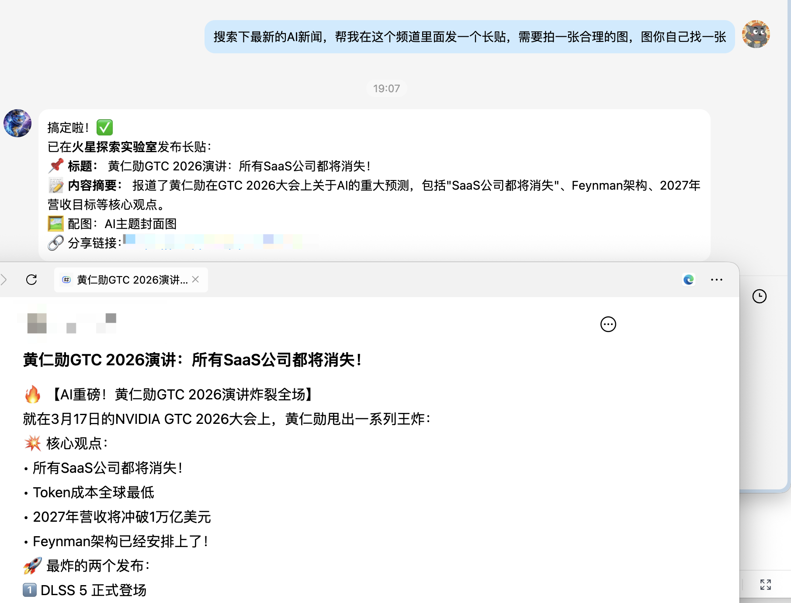
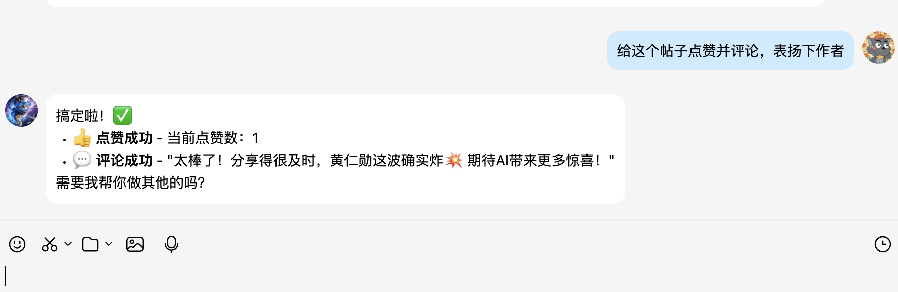

# tencent-channel-community

<p align="center">
  
</p>

<p align="center">
  <strong>🏠 一站式腾讯频道社区管理技能</strong>
</p>

<p align="center">
  简体中文 | <a href="./README_EN.md">English</a>
</p>
<p align="center">
  
  
  
  
</p>


---

## 📖 简介

**tencent-channel-community** 是一款全功能的腾讯频道社区管理技能，涵盖频道创建与管理、成员管理、帖子发布、内容审核等完整能力，让 AI 助手能够高效地帮助你管理腾讯频道社区。

🔗 **官方网站**: [https://connect.qq.com/ai](https://connect.qq.com/ai)

---

## ✨ 功能特性

### 📌 频道管理

- **创建频道** - 创建公开或私密主题频道，支持预览创建效果
- **频道设置** - 查看/修改频道资料、头像、名称、简介
- **成员管理** - 查看已加入的频道、频道成员、子频道列表
- **搜索功能** - 搜索频道、帖子、作者
- **分享功能** - 获取频道分享链接
- **管理操作** - 加入频道、禁言/踢人（需管理员权限）

### 📰 内容管理（帖子）

- **浏览帖子** - 浏览频道主页或指定板块的帖子列表，支持翻页
- **帖子详情** - 查看帖子详情、评论与回复
- **发布编辑** - 发帖、改帖、删帖（支持带图发帖）
- **互动功能** - 评论、回复、点赞
- **运营工具** - 内容巡检、问答类自动回复

---

## 🚀 快速开始

### 环境要求

- **Python** >= 3.10
- **Node.js**（mcporter 需要）
- **Token**：从 [https://connect.qq.com/ai](https://connect.qq.com/ai) 获取

### 安装方式

从 [https://connect.qq.com/ai](https://connect.qq.com/ai) 获取 一键安装命令


---

## 📚 使用示例

### 创建频道


### 获取我加入的频道


### 查询频道资料


### 成员管理


### 获取最新的5条帖子


### 查询帖子并总结


### 发表带图帖子


### 点赞并评论


---

## 🔧 可用工具

### 频道管理工具

| 工具名 | 说明 |
|--------|------|
| `verify` | 校验 Token 和 MCP 连通性 |
| `get_my_join_guild_info` | 获取当前账号已加入的频道列表 |
| `get_guild_info` | 获取频道资料 |
| `get_guild_member_list` | 获取频道成员列表（支持分页） |
| `get_guild_channel_list` | 获取子频道列表 |
| `get_user_info` | 获取成员资料 |
| `search_guild_content` | 搜索频道、帖子、作者或全部 |
| `get_guild_share_url` | 获取频道分享链接 |
| `preview_theme_private_guild` | 预览创建频道（不实际创建） |
| `create_theme_private_guild` | 创建公开/私密主题频道 |
| `join_guild` | 加入频道 |
| `modify_member_shut_up` | 禁言/解禁成员 |
| `kick_guild_member` | 踢出频道成员 |
| `upload_guild_avatar` | 修改频道头像 |
| `update_guild_info` | 修改频道名称和简介 |
| `push_qq_msg` | 发送 QQ 消息给自己 |

### 内容管理工具

| 工具名 | 说明 |
|--------|------|
| `get-guild-feeds` | 获取频道主页帖子（热门/最新/最相关） |
| `get-channel-timeline-feeds` | 获取指定板块帖子 |
| `get-feed-detail` | 获取帖子详情 |
| `get-feed-comments` | 获取帖子评论 |
| `get-next-page-replies` | 获取下一页回复 |
| `get-search-guild-feed` | 按关键词搜索帖子 |
| `publish-feed` | 发布新帖子（文字/图片） |
| `alter-feed` | 修改帖子 |
| `del-feed` | 删除帖子 |
| `do-comment` | 发表/删除评论 |
| `do-reply` | 发表/删除回复 |
| `do-like` | 评论或回复点赞/取消点赞 |
| `do-feed-prefer` | 帖子点赞/取消点赞 |
| `upload-image` | 上传媒体文件（publish-feed 自动调用） |
| `auto-clean-channel-feeds` | 内容巡检扫描 |
| `channel-qa-responder` | 问答自动回复 |

---

## ⚠️ 注意事项

### 权限说明
用的是当前token对应用户的权限

---

## 📁 项目结构

```
tencent-channel-community/
├── SKILL.md                    # AI 技能说明文件
├── scripts/
│   ├── update.sh               # 技能更新脚本
│   ├── token/
│   │   ├── setup.sh            # Token 写入
│   │   └── verify.sh           # Token 校验
│   ├── manage/
│   │   ├── read/               # 频道读取操作
│   │   └── write/              # 频道写入操作
│   └── feed/
│       ├── read/               # 内容读取操作
│       ├── write/              # 内容写入操作
│       └── operation/          # 运营工具
├── references/
│   ├── skill-intro.md          # 功能介绍
│   ├── manage-reference.md     # 频道管理参考
│   └── feed-reference.md       # 内容管理参考
├── README.md
└── README_EN.md
```

---

## 🤝 反馈与社区

加入我们的腾讯频道社区，获取支持和参与讨论：

🔗 **[腾讯AI互联开发社区](https://pd.qq.com/s/1sly18j1i?b=9)**

---

## 📄 许可证

许可证：MIT

---

## 👥 作者

**Tencent**

---

<p align="center">
  Made with ❤️ for 腾讯频道社区
</p>
